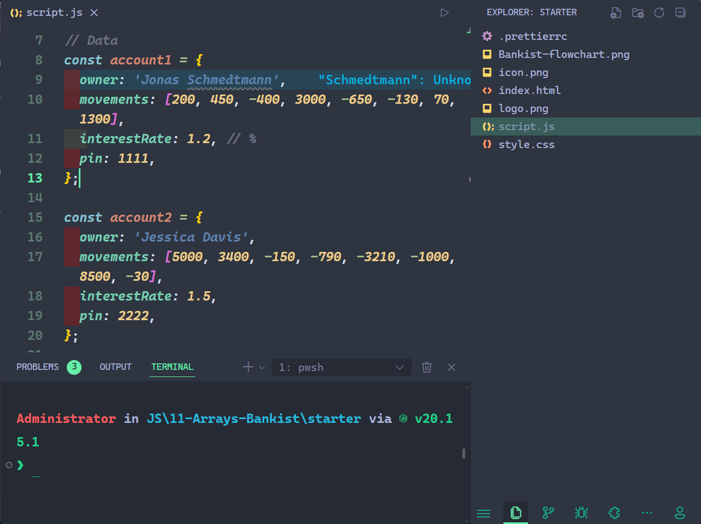

I've spent years refining my VS Code configuration to create a development environment that combines beauty, efficiency, and powerful functionality. Each extension and setting has been carefully selected to streamline my workflow, making it a setup I’m proud to share with fellow developers.
